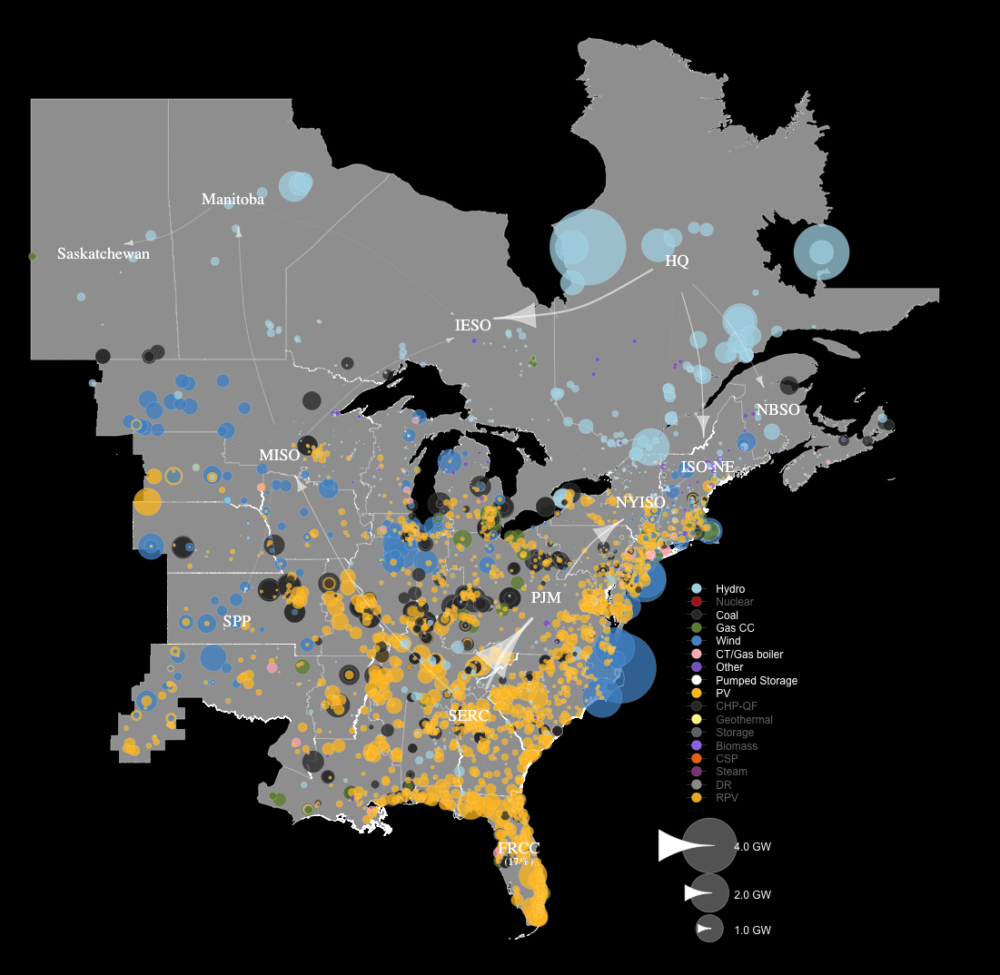
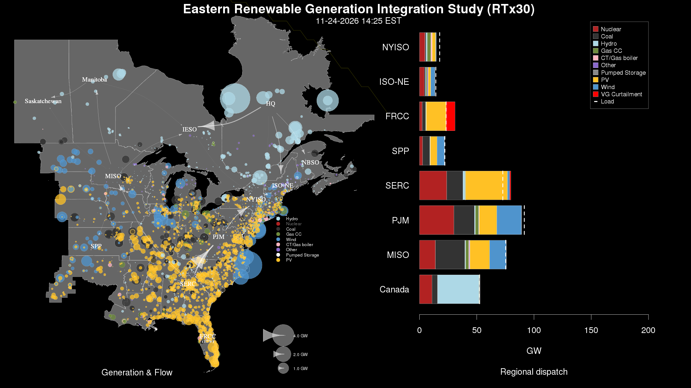
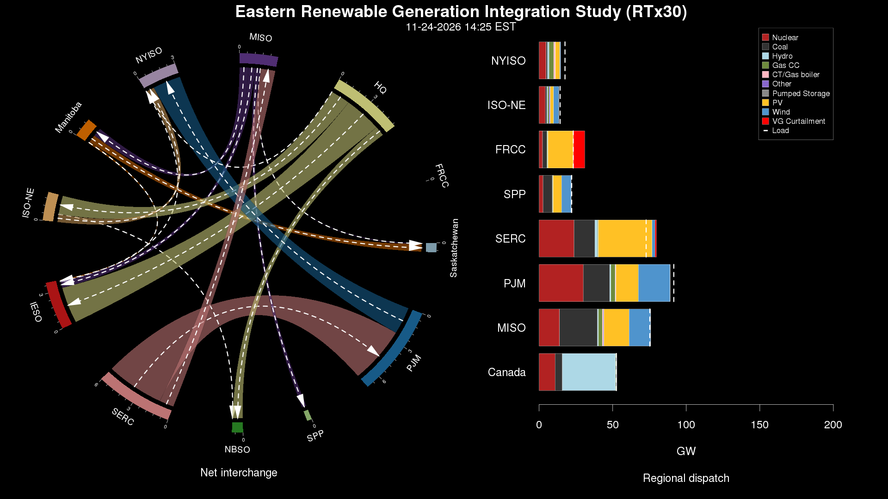
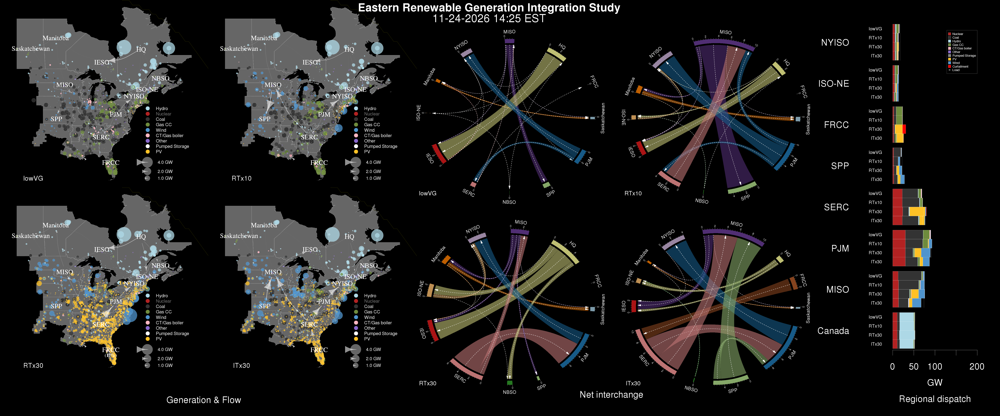

# kaleidoscope

`kaleidoscope` is an R package developed to visualize PLEXOS scenarios as packaged by the [`rplexos`](https://github.com/NREL/rplexos) R package. The package provides three types of visualizations intended to be used as coordinated views: a geographic diagram, a chord diagram, and dispatch charts. The geographic diagram provides a qualitative view of the study domain representing individual generator output and interregional transmission flows. The chord diagrams provide a more quantitative view of the net interchange between each of the regions. The dispatch charts are stacked and grouped bar charts providing an instantaneous snapshot of the generation mix by ISO and scenario. 

This package was developed to analyze data from the [`Eastern Renewable Generation Integration Study (ERGIS)`](http://www.nrel.gov/grid/ergis.html). The kaleidoscope functions are generic; however, there are are a set of ERGIS-specific helper functions for utilizing the kaleidoscope functions for the data generated by ERGIS. 

### ERGIS Example

Import the dependencies

```
library(devtools)
library(data.table)
library(sp)
library(maptools)
library(NightDay)
library(scales)
library(tidyr)
library(raster)
library(MASS)
library(RColorBrewer)
library(igraph)
library(circlize)
library(dplyr)
library(magrittr)
```
Load the ERGIS time-series data

```
ergis_generation = load_generation('~/ergis/data/final_report/generation_highNetLoad_R30P.csv', 'c_RT_R30P') 
ergis_generation = rbind(ergis_generation, load_generation('~/ergis/data/final_report/generation_highNetLoad_N30P.csv', 'c_RT_N30P'))
ergis_generation = rbind(ergis_generation, load_generation('~/ergis/data/final_report/generation_highNetLoad_SRPS.csv', 'c_RT_SRPS'))
ergis_generation = rbind(ergis_generation, load_generation('~/ergis/data/final_report/generation_highNetLoad_loVG.csv', 'c_RT_loVG'))

load("~/ergis/data/final_report/c_RT_netinterchange.RData") 
c_RT_netinterchange$time = as.POSIXlt(format(c_RT_netinterchange$time, "%Y-%m-%d %H:%M"), tz="EST")
load('~/ergis/data/final_report/c_RT_dispatch_stack_data.RData')
c_RT_dispatch_stack_data$time = as.POSIXlt(format(c_RT_dispatch_stack_data$time, "%Y-%m-%d %H:%M"), tz="EST")
```

Load and/or define static ERGIS data

```
regions=readShapeSpatial('~/data/ergis/regions.shp', proj4string=CRS('+proj=longlat +datum=WGS84 +no_defs +ellps=WGS84 +towgs84=0,0,0'))
ergis_generators = generators=read.csv('~/data/ergis/gen.csv', header=TRUE, sep=',')

centroids = read.csv('~/data/ergis/region-centroids.csv', header=T)
ergis_layout = layout = as.matrix(centroids[,2:3])
ergis_layout = as.matrix(centroids[,2:3])
ergis_verts = sapply(centroids$ISO, toString)

scenarios = data.frame('c_RT_loVG'='lowVG', 'c_RT_SRPS'='RTx10', 'c_RT_R30P'='RTx30', 'c_RT_N30P'='ITx30')
ergis_colors = data.table(type=c("Hydro", "Nuclear", "Coal", "Gas CC", "Wind", "CT/Gas boiler", "Other", "Pumped Storage", "PV", "CHP-QF", "Geothermal", "Storage", "Biomass", "CSP", "Steam", "DR", "RPV"),
                       color=c("#add8e6","#b22222","#333333","#6e8b3d","#4f94cd", "#ffb6c1","#8968cd", "#FFFFFF", "#ffc125", "gray20", "khaki1", "gray45", "mediumpurple2", "darkorange2", "orchid4", "gray60", "goldenrod2"))
ergis_iso = c("Saskatchewan", "PJM", "SPP", "NBSO", "SERC", "IESO", "ISO-NE", "Manitoba", "NYISO", "MISO", "HQ", "FRCC")
```
Plot the ERGIS generation map

```
t = as.POSIXlt("2006-11-24 14:25:00", tz="EST")

draw_density(t, 'None', ergis_generators, ergis_generation, ergis_colors)
draw_generators(t, c("Hydro", "Coal", "Gas CC", "Wind", "CT/Gas boiler", "Other", "Pumped Storage", "PV"), ergis_generators, ergis_generation, ergis_colors, scenario='c_RT_R30P', scaling=0.002)
draw_interchange(t, ergis_verts, ergis_layout, c_RT_netinterchange, c_RT_dispatch_stack_data, 'c_RT_R30P')
```


Or using the ERGIS helper functions, plot the geographic and dispatch views

```
draw_ergis(t)
```


Plot the chord and dispatch views

```
draw_ergis_chord(t)
```


Plot an Insight Center frame

```
draw_ergis_comparative_insight(t)
```

- - - 
Copyright © 2016 the Alliance for Sustainable Energy, LLC, All Rights Reserved
 
This computer software was produced by Alliance for Sustainable Energy, LLC under Contract No. DE-AC36-08GO28308 with the U.S. Department of Energy. For 5 years from the date permission to assert copyright was obtained, the Government is granted for itself and others acting on its behalf a nonexclusive, paid-up, irrevocable worldwide license in this software to reproduce, prepare derivative works, and perform publicly and display publicly, by or on behalf of the Government. There is provision for the possible extension of the term of this license. Subsequent to that period or any extension granted, the Government is granted for itself and others acting on its behalf a nonexclusive, paid-up, irrevocable worldwide license in this software to reproduce, prepare derivative works, distribute copies to the public, perform publicly and display publicly, and to permit others to do so. The specific term of the license can be identified by inquiry made to Contractor or DOE. NEITHER ALLIANCE FOR SUSTAINABLE ENERGY, LLC, THE UNITED STATES NOR THE UNITED STATES DEPARTMENT OF ENERGY, NOR ANY OF THEIR EMPLOYEES, MAKES ANY WARRANTY, EXPRESS OR IMPLIED, OR ASSUMES ANY LEGAL LIABILITY OR RESPONSIBILITY FOR THE ACCURACY, COMPLETENESS, OR USEFULNESS OF ANY DATA, APPARATUS, PRODUCT, OR PROCESS DISCLOSED, OR REPRESENTS THAT ITS USE WOULD NOT INFRINGE PRIVATELY OWNED RIGHTS.